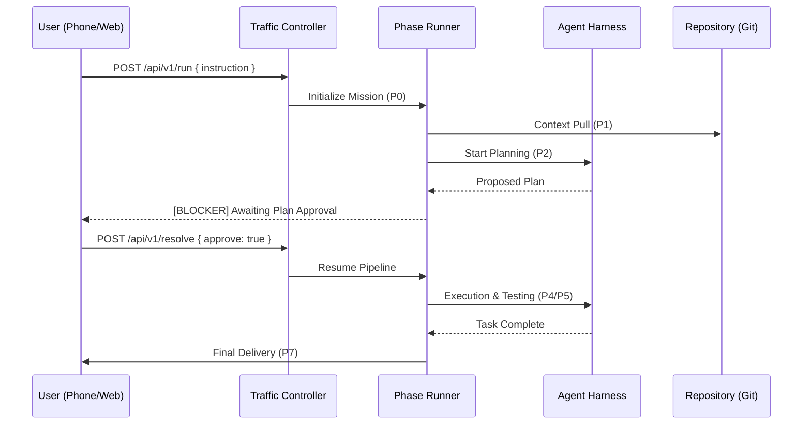

# System Architecture

NexusOS is built on a distributed, event-driven architecture that bridges high-level user intent with low-level agent execution. This document details the components, their interactions, and the data flow that powers the NexusOS pipeline.

## 🧱 Component Overview

The system is logically partitioned into four distinct layers:

```mermaid
componentDiagram
    [User Interface] <<PWA/Dashboard/CLI>> as UI
    [Traffic Controller] <<Rust/Axum Gateway>> as Gateway
    [Agent Harness] <<Python/Node Agent Engine>> as Harness
    [MCP Connectors] <<Standardized Tools>> as MCP
    database "SQLite Audit Log" as DB
    
    UI <--> Gateway : WebSocket/REST
    Gateway <--> Harness : Process Invocation
    Harness <--> MCP : JSON-RPC (stdio/http)
    Gateway --> DB : Persistent Audit
```

### 1. NexusOS Traffic Controller (Gateway)
The **Traffic Controller** is the high-performance core of NexusOS, written in Rust. It serves as:
- **API Gateway**: Exposes REST and WebSocket endpoints for external control.
- **Task Orchestrator**: Manages the mission queue and state transitions.
- **Notification Engine**: Integrates with Telegram for out-of-band communication.
- **Audit Logger**: Streams granular events to the SQLite persistence layer.

### 2. NexusOS Agent Harness
The **Agent Harness** contains the intelligence of the system. It leverages specialized agents optimized for specific stages of the software development lifecycle:
- **Planner**: Requirements analysis and task decomposition.
- **Architect**: System design and file-level planning.
- **Coder**: Test-driven implementation and refactoring.
- **Security**: Automated vulnerability and secret scanning via AgentShield.

### 3. MCP Connector Layer
NexusOS utilizes the **Model Context Protocol (MCP)** to provide agents with standardized access to third-party services:
- **Project Management**: Linear, Jira, or GitHub Issues.
- **Persistence**: Firebase, Supabase, or PostgreSQL.
- **Design**: Figma or Adobe XD via established MCP servers.

---

## 🔄 Interaction Flow (End-to-End Task Execution)

The following sequence illustrates a typical task being triggered from a phone and executed by the pipeline.



---

## 🛡️ Security Boundaries (AgentShield)

Security is woven into the architecture through **AgentShield**, which enforces three primary layers of protection:
1.  **FILESYSTEM ISOLATION**: Agents are strictly scoped to the repository workspace.
2.  **COMMAND GATING**: Dangerous shell commands (e.g., `rm -rf`, `sudo`) are intercepted at the harness level.
3.  **CREDENTIAL MASKING**: Sensitive environment variables are injected as needed by the Traffic Controller and never exposed to the agent's internal memory.
