# NexusOS Execution Pipeline (P0-P8)

The NexusOS Pipeline is a strict, phase-gated execution model that ensures reliability, transparency, and human governance throughout the agent lifecycle. Each "Mission" progresses through nine distinct phases (P0 to P8).

## 🚀 Pipeline Flowchart

```mermaid
flowchart LR
    P0[P0: Trigger] --> P1[P1: Context Pull]
    P1 --> P2[P2: Planning]
    P2 -- "HITL Approval" --> P3[P3: Architecture]
    P3 --> P4[P4: Execution]
    P4 --> P5[P5: Verification]
    P5 --> P6[P6: Review]
    P6 --> P7[P7: Delivery]
    P7 -- "Final Approval" --> P8[P8: Approval & Sync]

    style P2 fill:#f96,stroke:#333
    style P8 fill:#5f5,stroke:#333
```

---

## 📑 Phase Breakdown

### P0: Trigger
The entry point of the pipeline. Tasks can be initiated via:
- **Phone (PWA/Telegram)**: Conversational input.
- **REST API**: Direct system integration.
- **Web Dashboard**: Structured task input.

### P1: Context Pull
The system clones or pulls the latest state of the target GitHub repository into a sanitized, local workspace. This ensures the agent is working with the ground truth.

### P2: Planning (HITL Gate 1)
The **Planner Agent** analyzes the codebase and the instruction to generate a granular step-by-step implementation plan. 
- **Requirement**: The pipeline **pauses** here. The user must review and approve the plan via phone or web before the system proceeds.

### P3: Architecture
The **Architect Agent** maps the plan to the specific file system, identifying creating new files, modifying existing ones, or updating database schemas.

### P4: Execution
The **Code Agent** performs the actual implementation. It follows a Test-Driven Development (TDD) cycle, writing failing tests first and then implementing the logic to pass them.

### P5: Verification
The **Verification Agent** runs the full project test suite, checks build logs, and ensures that the new changes haven't introduced regressions.

### P6: Review
The **Review Agent** performs a secondary pass on the code, checking for:
- Security vulnerabilities (AgentShield).
- Performance bottlenecks.
- Coding standard compliance.

### P7: Delivery
The system packages the final output (diffs, logs, and summaries) and notifies the developer via Telegram and the Web Dashboard.

### P8: Approval & Sync (HITL Gate 2)
The user reviews the final delivery. Upon tapping **[Approve]**, the system:
1. Commits the changes with an auto-generated, descriptive message.
2. Pushes the changes to the remote repository.
3. Closes the mission and updates the audit log.

---

## 🧱 Blocker Resolution & State Management

If an agent encounters an ambiguity (e.g., a missing API key or a vague requirement), it emits a `BlockerEvent`. The pipeline enters a **BLOCKED** state, and the user is notified. Once resolved, the pipeline resumes exactly from where it left off.
