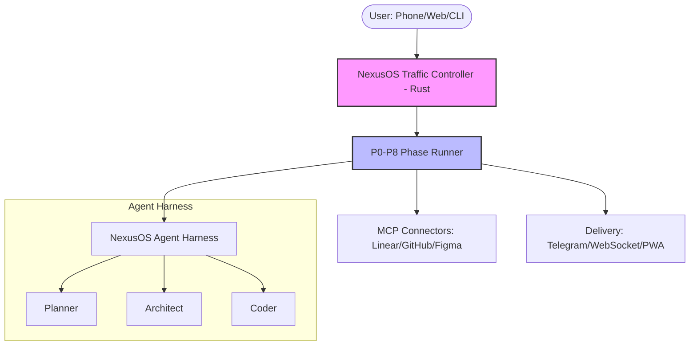

# NexusOS Agent Pipeline

[](https://opensource.org/licenses/MIT)
[](docs/prd.md)

NexusOS is an enterprise-grade, event-driven **Agent Mission Control** system designed for high-performance orchestration of autonomous AI agents. It provides a centralized control plane for commanding, monitoring, and securing agents across diverse environments—from local development to cloud-scale deployments.

## 🌟 Why NexusOS?

NexusOS solves the fragmentation and visibility challenges of modern AI agent workflows:
- **Centralized Command**: A unified gateway (Traffic Controller) to route tasks to specialized agents.
- **Remote Visibility**: Real-time observability via WebSockets and direct-to-phone notifications (Telegram/PWA).
- **Hardened Security**: The `AgentShield` framework enforces granular security rules and human-in-the-loop approvals.
- **Systematic Execution**: A strict P0-P8 pipeline ensures predictable outcomes and verification.

---

## 🏗️ High-Level Architecture



---

## 📁 Project Structure

NexusOS is organized as a **pnpm monorepo** for optimal dependency management and internal integration.

```text
nexusos/
├── docs/                      # Centralized Wiki, Architecture, and PRD
├── packages/
│   ├── traffic-controller/    # High-performance Rust (Axum) Gateway
│   ├── agent-harness/         # Core agent definitions and skills
│   ├── sdk-bridge/            # Adapters for custom engine integration
│   └── connectors/            # Model Context Protocol (MCP) implementations
├── dashboard/                 # Next.js 14 Real-time Observability UI
└── docker-compose.yml         # Local infrastructure (Persistence & Cache)
```

---

## 🚀 Quick Start

### 1. Prerequisites
- **Rust** (Stable) & **Node.js** (v18+)
- **pnpm**: `npm install -g pnpm`
- **Claude CLI**: `npm install -g @anthropic-ai/claude-code`

### 2. Installation
```bash
git clone https://github.com/Inmodel/NexusOS.git
cd NexusOS
pnpm install
```

### 3. Launch
```bash
# Start infrastructure
docker-compose up -d

# Start the Traffic Controller
cd packages/traffic-controller
cargo run
```

---

## 📖 Key Documentation

- **[Architecture Deep Dive](docs/Architecture.md)**: Component interactions and data flow.
- **[Execution Pipeline](docs/Execution-Pipeline.md)**: Detailed breakdown of the P0-P8 lifecycle.
- **[Product Requirements (PRD)](docs/prd.md)**: The definitive roadmap and feature specification.
- **[Security Model](docs/Security.md)**: AgentShield and Human-in-the-Loop governance.

---

## 🏆 Current Roadmap (v2.0)
- **Phase 1**: Core Pipeline & Foundation (✅ Complete)
- **Phase 2**: Observability & Real-time Delivery (✅ Complete)
- **Phase 3**: Dashboard & Intelligence Layer (🔄 In Progress)
- **Phase 4**: Multi-Agent Orchestration & Sub-Agencies (📅 Q2 2026)

---

© 2026 NexusOS Team. Built for the future of autonomous agent operations.
